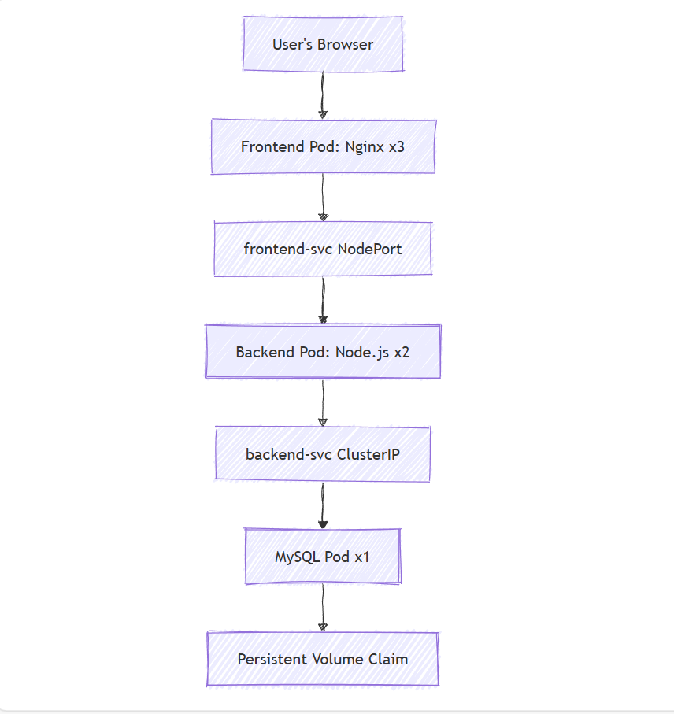
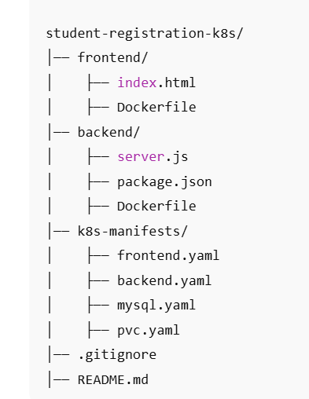

---

# 📚 Student Registration System on Kubernetes

## 📌 Overview
This project is a **3-tier Student Registration System** deployed on **Kubernetes (Minikube)**.  
It demonstrates how to containerize applications, orchestrate them with Kubernetes, and ensure resilience using **liveness** and **readiness probes**.

The system allows users to register their details through a frontend interface. These details are processed by a backend API and stored in a **MySQL database with persistent storage**.

---

# 🛠️ Tech Stack
- **Frontend:** HTML, CSS, served with **Nginx**
- **Backend:** Node.js (Express.js API)
- **Database:** MySQL with **Persistent Volume Claim (PVC)**
- **Containerization:** Docker (Minikube local registry)
- **Orchestration:** Kubernetes (Deployments, Services, PVCs, Probes)

---

## ⚙️ Features
✅ **Frontend Pod** (3 replicas) → Serves HTML form for student registration  
✅ **Backend Pod** (2 replicas) → Handles API logic, validates input, stores data in DB  
✅ **Database Pod** (1 replica) → MySQL with PVC for data durability  
✅ **Self-Healing** → Liveness & Readiness probes restart unhealthy pods  
✅ **Persistence** → Data remains intact even if DB pod restarts  
✅ **Scalability** → Multiple replicas for frontend & backend ensure load balancing  

---

# 🖼️ Architecture Diagram

## 📂 Project Structure

---

## 🚀 Deployment Guide
Some Basic Commands I used-
 minikube start
 minikube image build -t frontend:v1 ./frontend
 minikube image build -t backend:v1 ./backend
 kubectl apply -f k8s-manifests/
 kubectl get pods
 kubectl get svc
 minikube service frontend-svc

## 🧑‍💻 Skills Demonstrated
- Kubernetes (Deployments, Services, Probes, PVCs)
- Docker image building & local registry (Minikube)
- 3-tier architecture (Frontend, Backend, Database)
- Self-healing workloads with liveness/readiness probes
- Persistent storage with PVC in Kubernetes

👨‍💻 Author: Michael Ibeh
🔗 Connect with me on LinkedIn: https://linkedin.com/in/michael-ibeh-ify